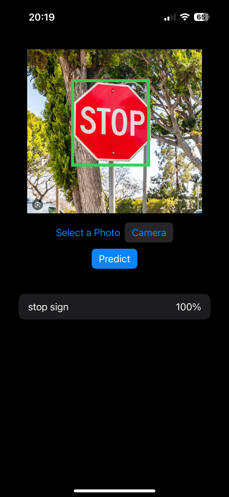

# DetectObjectML

Machine Learning iOS app that detects objects on images.

- ML Objects Detection with Vision and CoreML

📌 Notes:

This app contains good solution for implementing camera picker in SwiftUI.

YOLOv3Tiny.mlmodel has been added from Apple developer platform.

Download link: https://developer.apple.com/machine-learning/models

📸 Screenshots

<table>
  <tr>
    <td></td>
  </tr>
</table>
